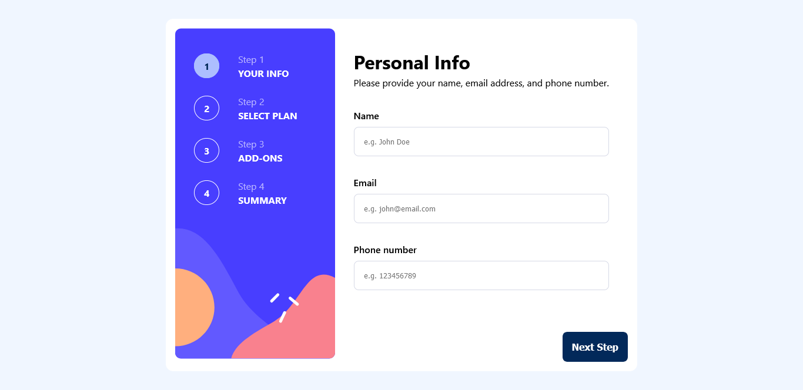

# Frontend Mentor - Multi-step form solution

This is a solution to the [Multi-step form challenge on Frontend Mentor](https://www.frontendmentor.io/challenges/multistep-form-YVAnSdqQBJ). Frontend Mentor challenges help you improve your coding skills by building realistic projects.

## Table of contents

- [Overview](#overview)
  - [The challenge](#the-challenge)
  - [Screenshot](#screenshot)
  - [Links](#links)
- [My process](#my-process)
  - [Built with](#built-with)
- [Author](#author)

## Overview

### The challenge

Users are able to:

- Complete each step of the sequence
- Go back to a previous step to update their selections
- See a summary of their selections on the final step and confirm their order
- View the optimal layout for the interface depending on their device's screen size
- See hover and focus states for all interactive elements on the page
- Receive form validation messages if:
  - A field has been missed **[In progress]**
  - The email address is not formatted correctly **[In progress]**

### Screenshot

### Links

- Solution URL: [Click here](https://your-solution-url.com)
- Live Site URL: [Click here](https://multistepform-react.vercel.app/)

## My process

### Built with

- [React](https://reactjs.org/) - JS library
- CSS custom properties
- Flexbox
- Mobile-first workflow

## Author

- Personal Page [Marcelo Oliveira](https://marcelooliveira.vercel.app)
- Linkedin - [Marcelo Oliveira](https://www.linkedin.com/in/marcelo-ferreira-de-oliveira/)
- Frontend Mentor - [@heiderick13](https://www.frontendmentor.io/profile/heiderick13)
